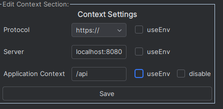
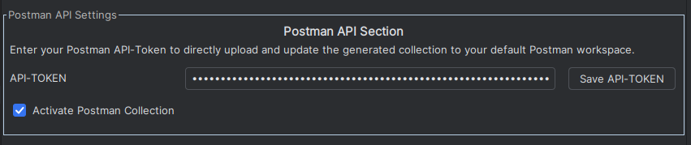

# Tool Window

## Context Settings

 

### Overview

The **Context Settings** panel lets you configure how the plugin connects to your server and application.

### Configuration Options

#### Protocol

| Option     | Description                                               |
|------------|-----------------------------------------------------------|
| `http://`  | Use plain HTTP                                            |
| `https://` | Use HTTPS for secure connections                          |
| `useEnv`   | Resolve protocol from environment variable `{{PROTOCOL}}` |  

---

#### Server

| Option           | Description                                    |
|------------------|------------------------------------------------|
| `localhost:8080` | Default value on first open                    |
| Custom value     | Enter any hostname + port manually             |
| `useEnv`         | Resolve from environment variable `{{SERVER}}` |  

---

#### Application

| Option       | Description                                              |
|--------------|----------------------------------------------------------|
| `/api`       | Default value on first open                              |
| Custom value | Enter any application context path manually              |
| `useEnv`     | Resolve from environment variable `{{APP_CONTEXT}}`      |
| Disable      | Leave the field empty to disable the application context |  

---

### Saving Changes

After modifying any settings, click **Save** to persist your changes.

---

## Postman API Settings
  
This section allows you to configure the Postman API integration to directly upload and update the generated collection to your default Postman workspace.

**Interaction Fields:**
- `API-TOKEN`: Your personal Postman API token.
- `Save API-TOKEN`: Click to save the entered API token.
- Checkbox: `Activate Postman Collection`  
  Enable this option to automatically activate the generated Postman collection after saving the API token.

When enabled, the generated Postman collection will be pushed directly to your default Postman workspace. The name of the imported workspace is **Generated Requests**. Enter a valid API token in the input field, and when you press the **Save API-TOKEN** button, the token will be validated.  
 
The state of the `Activate Postman Collection`-button will be saved automatically.  
To see what kind of requests the plugin performs, check the documentation about the Postman API cURLs [here](PostmanAPI.md).
